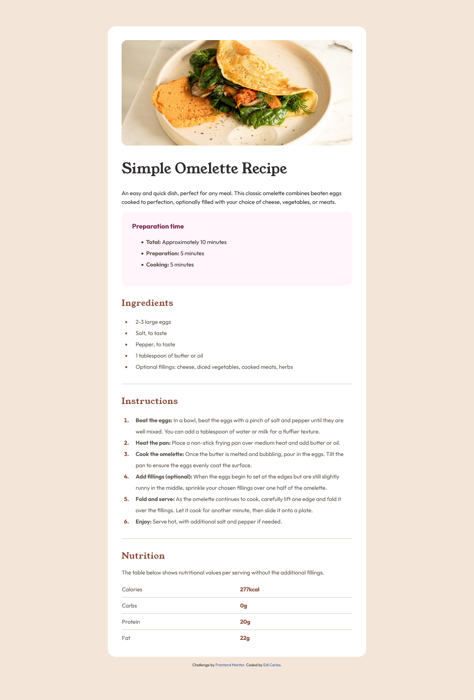

# Frontend Mentor - Recipe page solution

This is a solution to the [Recipe page challenge on Frontend Mentor](https://www.frontendmentor.io/challenges/recipe-page-KiTsR8QQKm).

## Table of contents

- [Overview](#overview)
  - [Screenshot](#screenshot)
  - [Links](#links)
- [My process](#my-process)
  - [Built with](#built-with)
- [Author](#author)

## Overview

### Screenshot

### Links

- Solution URL: [Github repo](https://github.com/ediCarlosSilva/recipe-page-clg)
- Live Site URL: [Website](https://edicarlossilva.github.io/recipe-page-clg/)

## My process

### Built with

- Semantic HTML5 markup
- CSS custom properties
- Flexbox
- CSS Grid
- Mobile-first workflow
- [SCSS](https://sass-lang.com/) - SCSS
- [Gulp](https://gulpjs.com/) - A toolkit to automate & enhance your workflow

## Author

- Website - [Edi Carlos](https://edicarlossilva.github.io)
- Frontend Mentor - [@ediCarlosSilva](https://www.frontendmentor.io/profile/ediCarlosSilva)
